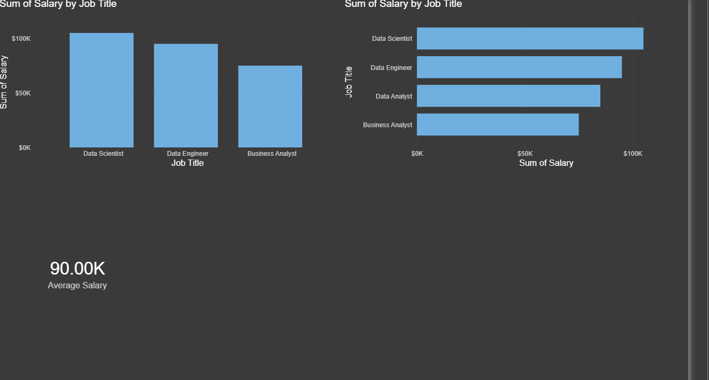

# Data Jobs Dashboard w/ PowerBi

## Intoduction

The Data Jobs Dashboard is **an interactive business intelligence solution developed using Power BI** to analyze and visualize trends in the data job market. The dashboard provides valuable insights into job roles, salary distributions, required skills, company hiring patterns, work arrangements, and geographic demand for data-related positions.

With the rapid growth of data-driven decision-making, organizations are increasingly seeking professionals such as **Data Analysts, Data Scientists, Data Engineers, Business Intelligence Analysts, Machine Learning Engineers,** and AI Specialists. Understanding these market trends is important for students, job seekers, recruiters, and organizations.

## Skills Showcased

- **Data Cleaning and Transformation** – Processed and prepared raw job market data using Power Query and data modeling techniques.
- **Data Visualization** – Created interactive and informative visualizations to represent job market trends effectively.
- **Business Intelligence (BI)** – Utilized Power BI to convert complex datasets into meaningful business insights.
- **Data Analysis** – Analyzed salary trends, job demand, hiring patterns, and skill requirements across various data-related roles.
- **Dashboard Design** – Designed a user-friendly and professional dashboard layout with clear navigation and interactive elements.

## Conclusion

The Data Jobs Dashboard successfully transforms raw job market data into meaningful and actionable insights using Power BI. Through interactive visualizations and data-driven analysis, the dashboard provides a comprehensive view of job demand, salary trends, required skills, work arrangements, and geographic opportunities within the data industry.
